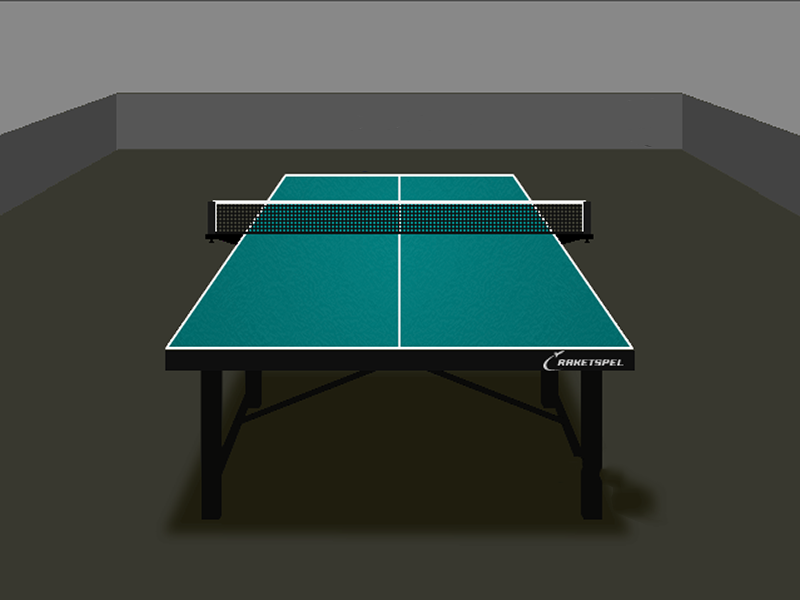
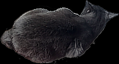
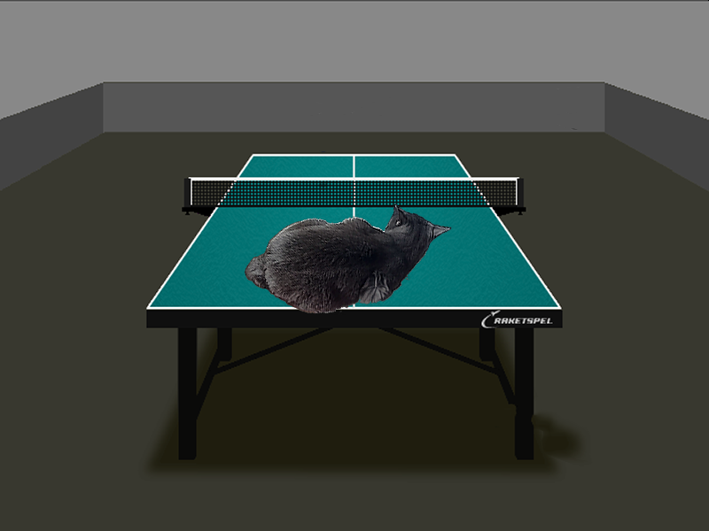

# Alpha_Blending

Задача состояла в оптимизации алгоритма альфа-смещения. Альфа-смещение - комбинирование изображения с фоном для создания эффекта частичной прозрачности.(Википедия)

В качестве фона я использовал изображение стола:

В качестве накладываемого изобажения я использовал этого котика:

Результат наложения получался следующим:

# Image handling

В этой работе я

# Algorithm

Суть алгоритма заключается в следующем. Каждый из цвет результирующего пикселя считаем так:

~~~C++
result_pixel.color = (front_pixel.alpha*front_pixel.color + (255 - front_pixel.alpha)*back_pixel.color)/255
~~~

# Optimization results

| O_flag | SSE/NO SSE  |  FPS  |  Coeff |
| :----: |  :--------: | :---: | :----: |
|  -O0   |    NO SSE   | 231.8 |        |
|  -O2   |    NO SSE   | 519.2 |        |
|  -O3   |    NO SSE   | 489.0 |        |
| -Ofast |    NO SSE   | 470.4 |        |
| :----: |  :--------: | :---: | :----: |

# Results

Как и в предыдущей работе я пользовался 